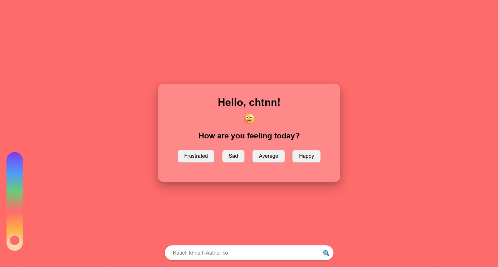

# Mood Food Suggestion

A fun and interactive web app that suggests food combinations based on your current mood. The app uses your name to personalize the experience and displays dynamic colors and animations.

---

## Features

- Personalized greeting using the user's name.
- Mood-based food combination suggestions (Frustrated, Sad, Average, Happy).
- Fun emojis reflecting your current mood.
- Dynamic background color and thermometer animation based on the first letter of your name.
- GPT-style input bar for user interaction.
- Retry button to try new combinations.
- Lightweight, responsive, and visually appealing design.

---

## Demo

You can try the app by opening the `index.html` file in a browser.

---

## Screenshots

 

---

## How it Works

1. The app prompts the user to enter their name.
2. Based on the first letter of the name, it changes the background color and positions a ball on a thermometer-like visual.
3. The user selects their mood by clicking one of the buttons.
4. The app simulates a "thinking" process and then displays:
   - A food combination suggestion.
   - A fun message based on the selected mood.
5. Users can click "Try Again" to get a new combination.

---

## Technologies Used

- HTML5
- CSS3
- JavaScript (ES6)
- No external libraries required

---

## File Structure

├── index.html # Main HTML file
└── README.md # Project documentation


---

## How to Use

1. Clone this repository:

```bash
git clone https://github.com/your-username/mood-food-suggestion.git
